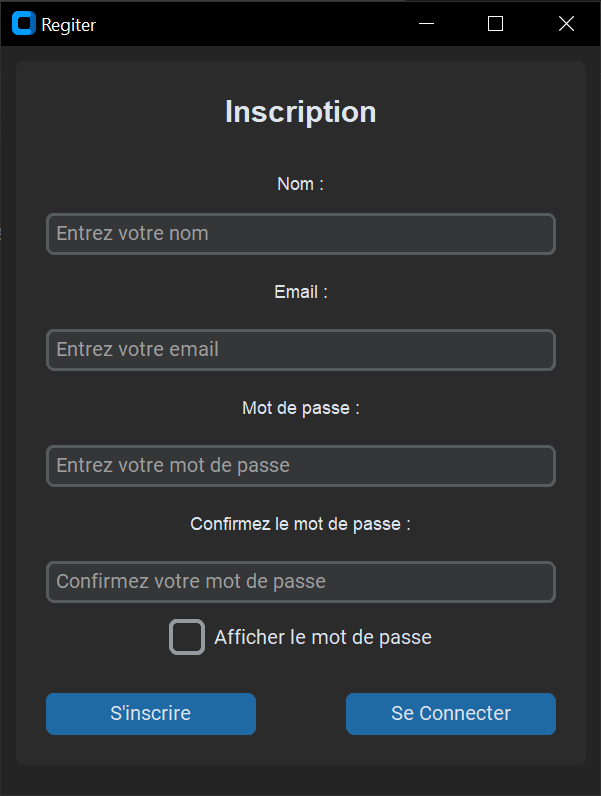
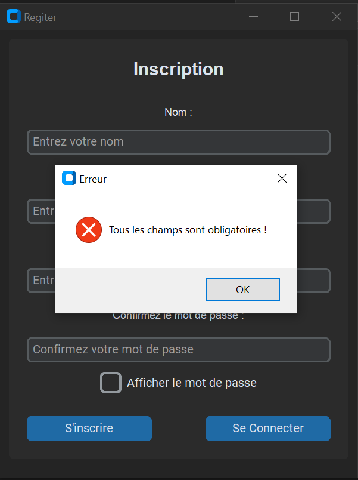
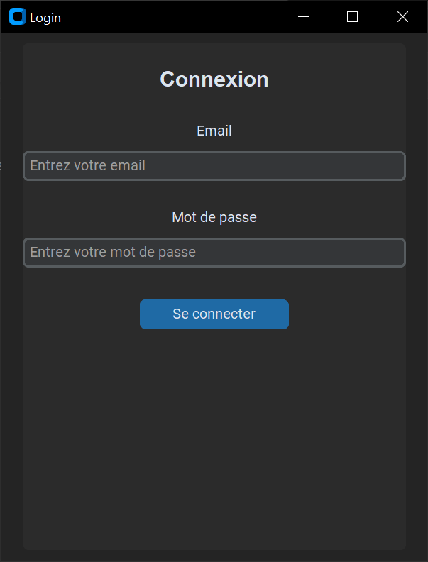
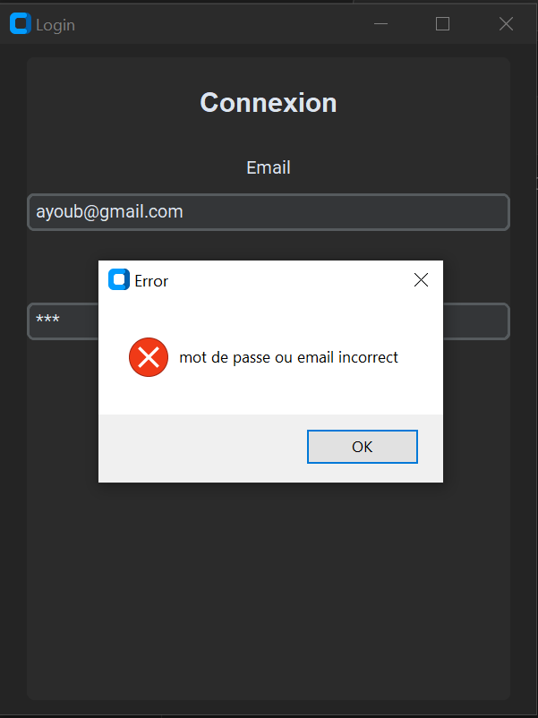
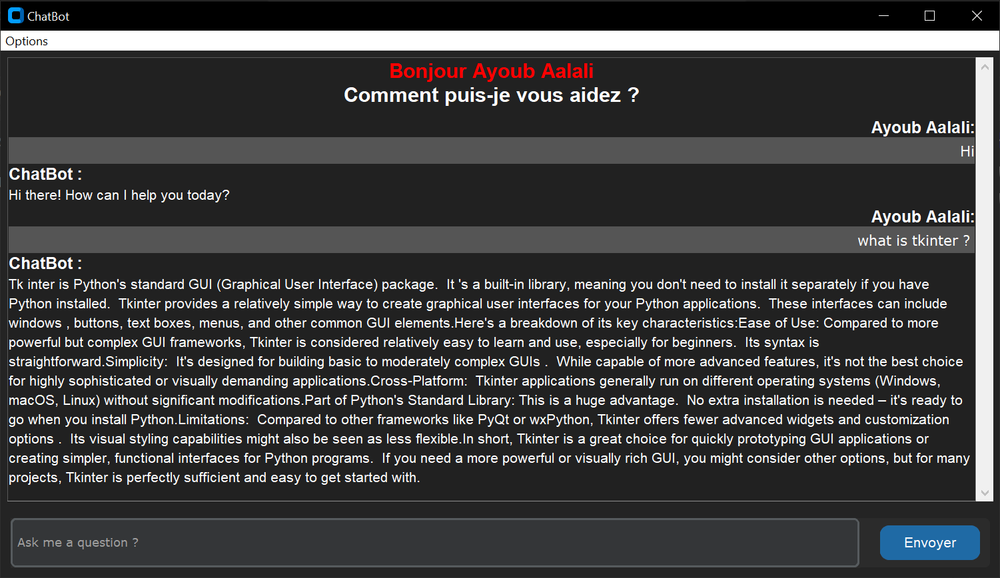
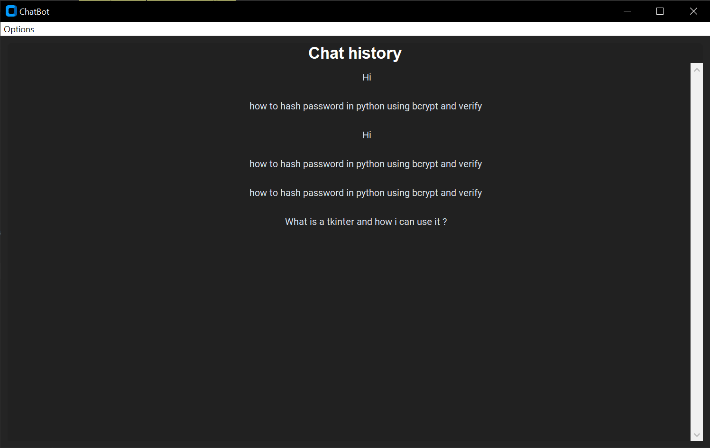

# ChatBot Application

## Description
Ce projet est une application de ChatBot qui utilise l'API générative (ici, via Google Generative AI avec le modèle Gemini) pour répondre aux questions des utilisateurs. Le projet se compose de :

- **Un serveur** qui gère les connexions clients, traite les requêtes, interagit avec l'API générative et stocke les données (utilisateurs et historique des conversations) dans une base de données SQLite.  
- **Une interface graphique client** développée avec Tkinter et CustomTkinter, qui permet aux utilisateurs de s'inscrire, se connecter, envoyer des messages et consulter l'historique de leurs conversations.
- **Un module utilitaire** pour le hachage et la vérification sécurisée des mots de passe à l'aide de bcrypt.

## Prérequis
- **Python 3.x** (vérifiez la version recommandée)
- **Modules Python** (à installer via pip) :
  - `google-generativeai`
  - `IPython`
  - `bcrypt`
  - `customtkinter`
  - `Pillow`
  - (Les modules `socket`, `threading`, `sqlite3` et `tkinter` font partie de la bibliothèque standard)

## Installation
1. **Cloner le dépôt :**
   ```bash
   git clone https://github.com/aalaliayoub/ChatBot.git
   cd ChatBot
## Interface graphique

<table>
  <tr>
    <td></td>
    <td></td>
  </tr>
  <tr>
    <td></td>
    <td></td>
  </tr>
  <tr>
    <td></td>
    <td></td>
  </tr>
</table>
